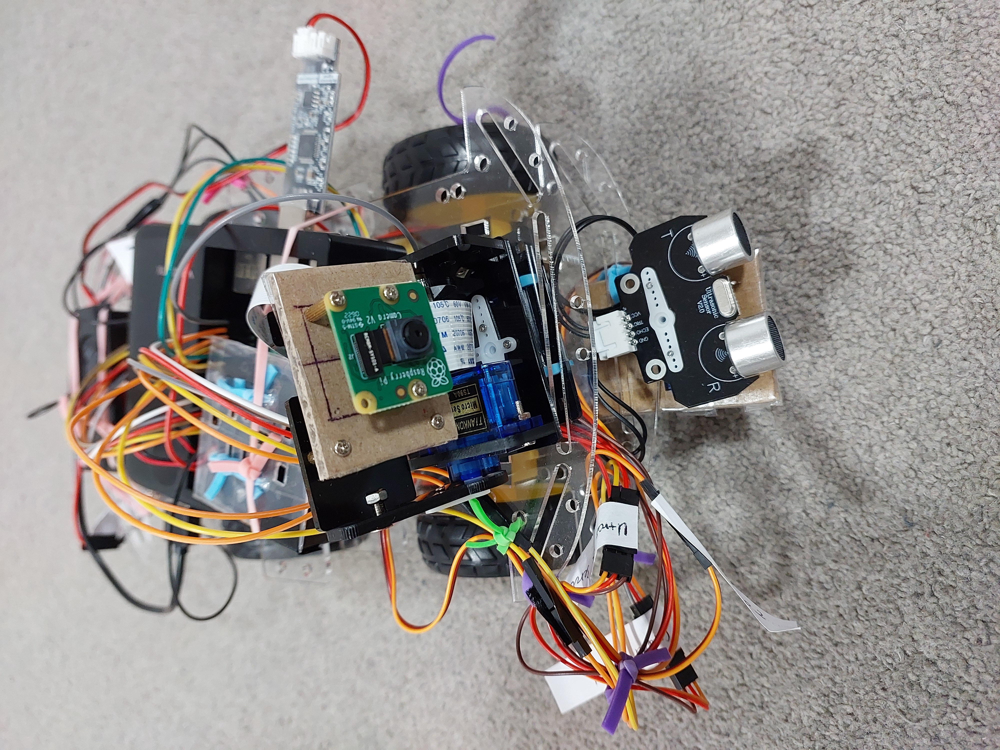

# RoboTinkerQuest
# Robotics Learning Project

## Description
This repository showcases various projects and experiments related to robotics, including sensor scanning, voice control movement, and using YOLO on a Raspberry Pi.

## Files

### Images
- 

### Videos
- [Ultrasonic Sensor Scanning](ultrasonic_sensor_scanning.mp4)
- [Voice Control Movement](voice_control_movement.mp4)

### GIFs

